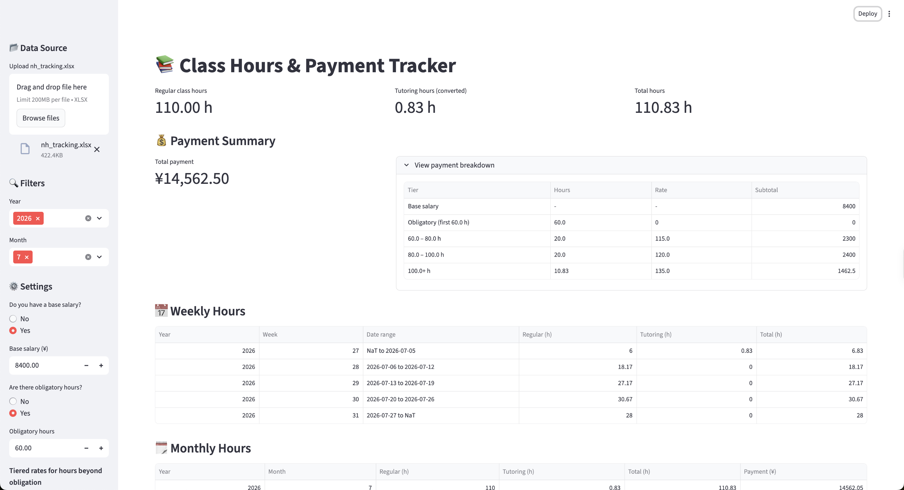
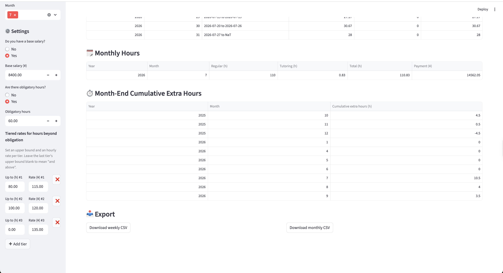

# Class Hours & Payment Tracker

This tool provides a convenient way to calculate and present class hours and monthly payments for private tutors. It was developed in response to my own experience working as a tutor and the realizing the need for a centralized system to organize and track working hours.

I built a Streamlit web app that parses a teaching-tracking Excel workbook, computes class hours and calculates monthly payments under user-specified scheme.



---

## Features

- **Upload and parse `.xlsx`** — reads every sheet in your tracking workbook, forwards-filled dates, and extracts year / month / ISO week.
- **Tutoring conversion** — rows whose `content` is `辅导` (tutoring) are counted at 1/4 (default setting) of their wall-clock duration.
- **Leave / cancellation handling** — rows marked `请假` (leave) or `取消` (cancelled) are zeroed out before hour calculation.
- **Weekly view** — aggregated hours per ISO week, with each week's Monday–Sunday date range.
- **Monthly view** — aggregated hours per calendar month, plus a computed payment column.
- **Cumulative extra hours** — month-end carryover of the `note` column, with negative balances reset to zero.
- **Configurable pay scheme** (persisted to `nh_setting.json`):
  - Optional base salary
  - Optional obligatory hours (unpaid quota)
  - Flat hourly rate **or** tiered rates on absolute hours
- **CSV export** — one-click download of the weekly and monthly tables.

---

## Demo

### Landing page


### Settings sidebar


---

## Getting started

### 1. Clone the repo

```bash
git clone git@github.com:harpercheng91/class-hour-tracker.git
cd class-hour-tracker
```

### 2. Create a virtual environment

```bash
python3 -m venv venv
source venv/bin/activate
```

On Windows, use:

```bash
venv\Scripts\activate
```

### 3. Install dependencies

```bash
pip install -r requirements.txt
```

### 4. Run the app

```bash
streamlit run nh_app.py
```

Streamlit will open `http://localhost:8501` in your browser.

---

## Input file format

The app expects an Excel workbook with one or more sheets. Each sheet must contain at least the following columns:

| Column | Type | Description |
|---|---|---|
| `date` | date | Class date; may be blank on continuation rows (forward-filled) |
| `days_of_week` | number | 1 = Monday, …, 7 = Sunday |
| `class_start_time` | string | the time when a class starts, e.g. `13:00` |
| `class_end_time` | string | the time when a class ends, e.g. `15:00` |
| `content` | string | the content of the class. `辅导` (tutoring) marks a tutoring session, counted at 1/4 |
| `progress` | string | `请假` (leave) or `取消` (cancelled) marks a cancelled row |
| `note` | number | Signed adjustment for cumulative extra hours |

Sheets are concatenated; column names must match exactly.

---

## Configuration

Payment settings are stored in `nh_setting.json` next to the script and reloaded automatically on every run. Editing the file by hand is supported — the app re-syncs when the file's modification time changes.

Example:

```json
{
  "has_base_salary": "Yes",
  "base_salary": 8400.0,
  "has_obligation": "Yes",
  "obligation_hours": 60.0,
  "flat_rate": 0.0,
  "rules": [
    { "upper": 80.0, "rate": 115.0 },
    { "upper": 100.0, "rate": 120.0 },
    { "upper": null, "rate": 135.0 }
  ]
}
```

### Field reference

| Field | Meaning |
|---|---|
| `has_base_salary` | `Yes` / `No` — whether a fixed base salary applies |
| `base_salary` | Fixed monthly amount, added on top of hourly pay |
| `has_obligation` | `Yes` / `No` — whether the first N hours are unpaid |
| `obligation_hours` | Number of obligation hours each month |
| `flat_rate` | Hourly rate used when `has_obligation` is `No` |
| `rules` | Tiered rates; `upper` is an absolute hour bound (including obligatory hours), `null` means "and above" |

### Example pay calculation

Given `obligation_hours = 60` and the rules above:

| Total hours | Payment calculation |
|---|---|
| 50 | Base salary only (under obligation) |
| 70 | Base + 10 × 115 |
| 90 | Base + 20 × 115 + 10 × 120 |
| 120 | Base + 20 × 115 + 20 × 120 + 20 × 135 |

---

## Project structure

```
class-hour-tracker/
├── nh_app.py                    # Streamlit application
├── nh_setting.json              # Persisted payment settings (gitignored)
├── requirements.txt             # Python dependencies
├── pic/
│   ├── screenshot.png           # Landing-page screenshot
│   └── screenshot_settings.png  # Settings sidebar screenshot
└── README.md
```

---

## Deployment

### Run locally

```bash
streamlit run nh_app.py
```
